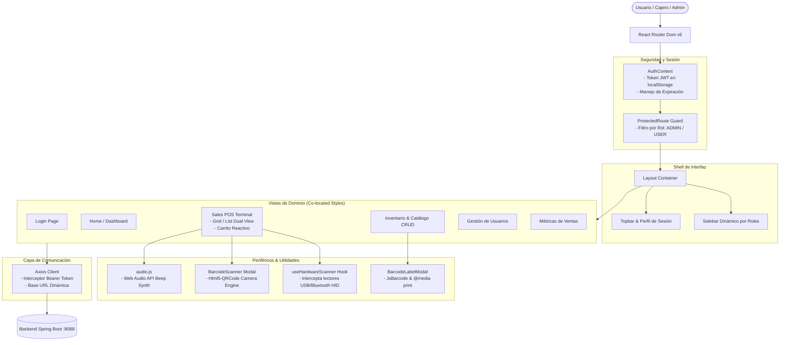

# 🛒 MarketCali - Frontend Web Application

[](https://react.dev/)
[](https://vitejs.dev/)
[](https://reactrouter.com/)
[](https://nginx.org/)
[](https://www.docker.com/)
[](LICENSE)

**MarketCali Frontend** es la aplicación web interactiva de **Punto de Venta (POS) y Administración de Supermercados**. Construida sobre **React 18** y empaquetada con **Vite**, ofrece una experiencia fluida, rápida y ergonómica tanto para cajeros en terminales de alta velocidad como para gerentes de inventario y administradores comerciales.

---

## 📑 Tabla de Contenidos

- [Visión General & Enfoque de Usuario](#-visión-general--enfoque-de-usuario)
- [Arquitectura de la Aplicación](#-arquitectura-de-la-aplicación)
- [Estructura del Proyecto (Domain-Driven & Co-location)](#-estructura-del-proyecto-domain-driven--co-location)
- [Funcionalidades Principales](#-funcionalidades-principales)
  - [1. Terminal POS con Vista Dual (Grid vs. List)](#1-terminal-pos-con-vista-dual-grid-vs-list)
  - [2. Escaneo Híbrido: Hardware HID + Cámara Óptica](#2-escaneo-híbrido-hardware-hid--cámara-óptica)
  - [3. Generación e Impresión Térmica de Etiquetas](#3-generación-e-impresión-térmica-de-etiquetas)
  - [4. Control de Acceso Basado en Roles (RBAC)](#4-control-de-acceso-basado-en-roles-rbac)
  - [5. Sistema de Diseño & Ergonomía Visual](#5-sistema-de-diseño--ergonomía-visual)
- [Guía de Instalación y Ejecución](#-guía-de-instalación-y-ejecución)
  - [Desarrollo Local](#desarrollo-local)
  - [Compilación para Producción](#compilación-para-producción)
  - [Despliegue con Docker y Nginx](#despliegue-con-docker-y-nginx)
- [Integración con Backend & Proxy](#-integración-con-backend--proxy)
- [Buenas Prácticas Implementadas](#-buenas-prácticas-implementadas)
- [Roadmap Frontend](#-roadmap-frontend)

---

## 💡 Visión General & Enfoque de Usuario

El frontend fue diseñado con énfasis en la ergonomía de turno laboral (8 horas continuas) y la velocidad en la fila de cobro:

*   **Para el Cajero / Empleado**:
    *   Soporte nativo para pistolas lectoras de códigos de barras USB/Bluetooth sin necesidad de enfocar campos de texto.
    *   Feedback acústico en cada lectura para trabajar sin desviar la mirada de la banda de productos.
    *   Cálculo automático de cambio en efectivo y selector de métodos de pago inmediatos.
*   **Para el Administrador / Gerente**:
    *   Mantenimiento ágil de inventario con alertas visuales de bajo stock.
    *   Generador en vivo de códigos de barras para etiquetar estanterías y productos a granel.
    *   Control integral de usuarios y métricas de facturación.

---

## 🏛️ Arquitectura de la Aplicación



---

## 📂 Estructura del Proyecto (Domain-Driven & Co-location)

El código fuente sigue las mejores prácticas de **co-localización** (cada componente vive junto a su hoja de estilos y dependencias inmediatas), eliminando hojas de estilo globales desordenadas y facilitando el mantenimiento:

```
marketcali-react/
├── index.html                      # Documento raíz HTML
├── vite.config.js                  # Configuración de empaquetado y proxy reverso en dev
├── nginx.conf                      # Servidor Nginx de producción (SPA fallback y proxy pass)
├── Dockerfile                      # Build multietapa (Node 18 Alpine -> Nginx Alpine)
├── package.json                    # Dependencias y scripts del proyecto
│
└── src/
    ├── Main.jsx                    # Punto de entrada de React (montaje y estilos base)
    ├── App.jsx                     # Definición de rutas declarativas y Providers
    │
    ├── api/                        # Capa de consumo HTTP centralizada
    │   └── client.js               # Instancia de Axios con interceptores JWT automáticos
    │
    ├── assets/                     # Recursos gráficos locales
    │   ├── logo2.png
    │   └── logo3.png
    │
    ├── context/                    # Estado global de la aplicación
    │   └── AuthContext.jsx         # Contexto de autenticación, roles y sesión activa
    │
    ├── hooks/                      # Custom Hooks reutilizables
    │   └── useHardwareScanner.js   # Captura global de ráfagas HID (lectores físicos de código de barras)
    │
    ├── utils/                      # Utilidades transversales
    │   └── audio.js                # Síntesis acústica de confirmación (Beep POS con Web Audio API)
    │
    ├── styles/                     # Tokens de diseño y reseteo
    │   ├── variables.css           # Variables CSS: paleta esmeralda, sombras, radios, tipografías
    │   ├── base.css                # Reseteo CSS moderno, scrollbars estilizadas y animaciones
    │   └── App.css                 # Clases utilitarias compartidas
    │
    ├── components/                 # Componentes modulares reutilizables
    │   ├── auth/
    │   │   └── ProtectedRoute.jsx  # Guardián de rutas por autenticación y roles
    │   ├── common/                 # Componentes atómicos transversales
    │   │   ├── BarcodeScanner.jsx  # Escáner óptico flotante con selector de cámara
    │   │   ├── BarcodeScanner.css  # Visor óptico con retícula de apuntado y láser animado
    │   │   ├── BarcodeLabelModal.jsx # Modal generador de etiquetas de código de barras
    │   │   └── BarcodeLabelModal.css # Estilos optimizados para impresión física (@media print)
    │   └── layout/                 # Shell de interfaz
    │       ├── Layout.jsx & .css   # Contenedor estructural principal
    │       ├── Sidebar.jsx & .css  # Menú de navegación lateral con filtrado de permisos
    │       └── Topbar.jsx & .css   # Barra superior con datos de usuario y logout
    │
    └── pages/                      # Vistas organizadas por dominio funcional
        ├── auth/
        │   ├── Login.jsx           # Formulario de acceso con validación
        │   └── Login.css           # Estilos de la pantalla de bienvenida y login
        ├── home/
        │   ├── HomePage.jsx        # Tablero de inicio y bienvenida rápida
        │   └── HomePage.css        # Estilos del dashboard principal
        ├── productos/              # Dominio: Catálogo e Inventario
        │   ├── ProductoCRUD.jsx    # Tabla administrativa de inventario, stock y acciones
        │   ├── ProductoCRUD.css    # Estilos de tabla, filtros y modales
        │   ├── Producto.jsx        # Formulario especializado de registro de artículos
        │   ├── Producto.css        # Estilos del formulario de alta
        │   ├── ProductoVisualizador.jsx # Catálogo de consulta visual para cajeros
        │   └── ProductoVisualizador.css # Cuadrícula de consulta rápida
        ├── sales/                  # Dominio: Punto de Venta (POS)
        │   ├── SalesPage.jsx       # Terminal de cobro: vista dual, carrito, ticket e inputs
        │   └── SalesPage.css       # Panel de venta de alta densidad visual
        ├── reports/                # Dominio: Métricas y Reportes
        │   ├── ReportsPage.jsx     # Visualizador de ingresos y estadísticas de venta
        │   └── ReportsPage.css     # Estilos de tarjetas métricas
        └── users/                  # Dominio: Administración de Usuarios
            ├── UsersPage.jsx       # Tabla de personal y asignación de roles
            └── UsersPage.css       # Estilos de gestión de usuarios
```

---

## ⚡ Funcionalidades Principales

### 1. Terminal POS con Vista Dual (Grid vs. List)
La pantalla de ventas (`/sales`) permite alternar instantáneamente la disposición de los productos según la preferencia del cajero:
*   **Modo Cuadrícula (Grid)**: Tarjetas interactivas con foto o avatar de categoría, precio destacado y badge de stock restante. Ideal para terminales de pantalla táctil o cajeros que identifican productos visualmente.
*   **Modo Lista (Table)**: Tabla compacta de alta densidad orientada al teclado. Muestra código de barras, nombre, precio y stock en una sola fila.
*   **Panel de Cobro en Vivo**:
    *   Controles rápidos para incrementar, decrementar o eliminar ítems del carrito.
    *   Cálculo automático de cambio (*Change Due*) al ingresar el efectivo recibido.
    *   Soporte para múltiples formas de pago: `EFECTIVO`, `TARJETA`, `TRANSFERENCIA`.

---

### 2. Escaneo Híbrido: Hardware HID + Cámara Óptica

*   **Lector Físico de Códigos de Barras (Hardware HID)**:
    *   Gestionado por el custom hook [`useHardwareScanner`](src/hooks/useHardwareScanner.js).
    *   Detecta ráfagas de pulsaciones de teclado consecutivas con un umbral de tiempo inferior a 50 milisegundos entre caracteres, finalizadas con la tecla `Enter`.
    *   **Ventaja clave**: El cajero no necesita hacer clic en ningún campo de búsqueda; puede pasar el producto por la pistola lectora en cualquier momento y se agregará directamente al carrito.
*   **Escáner Óptico por Cámara Web / Móvil**:
    *   Integrado mediante [`BarcodeScanner`](src/components/common/BarcodeScanner.jsx) y la biblioteca `html5-qrcode`.
    *   Incluye selector de dispositivo para alternar entre cámaras integradas y cámaras externas USB.
    *   Diseño con retícula de apuntado y animación láser de escaneo.
*   **Feedback Acústico (POS Beep)**:
    *   Utiliza la **Web Audio API** del navegador a través de [`audio.js`](src/utils/audio.js) para sintetizar un tono de frecuencia limpio (1760 Hz) durante 70ms al confirmar la lectura, imitando las terminales de caja profesionales de cadenas como Éxito o Carulla.

---

### 3. Generación e Impresión Térmica de Etiquetas

*   Desde el módulo de Inventario (`/productos`), el administrador puede pulsar el botón **"Etiqueta"** en cualquier artículo.
*   El componente [`BarcodeLabelModal`](src/components/common/BarcodeLabelModal.jsx) genera un código de barras en estándar **CODE128** en formato SVG vectorial mediante `JsBarcode`.
*   Cuenta con una regla de impresión `@media print` preconfigurada para ajustar las etiquetas a impresoras térmicas estándar (50mm × 30mm) con nombre del producto, código alfanumérico legible y precio en pesos colombianos.

---

### 4. Control de Acceso Basado en Roles (RBAC)

*   **Rutas Protegidas**: [`ProtectedRoute`](src/components/auth/ProtectedRoute.jsx) intercepta cada cambio de ruta. Si no hay sesión activa o el token expiró, redirige inmediatamente a `/login`.
*   **Matriz de Permisos por Rol**:

| Módulo / Ruta | Rol `ADMIN` | Rol `USER` (Cajero / Empleado) |
| :--- | :---: | :---: |
| **Inicio (`/`)** | ✅ Permitido | ✅ Permitido |
| **Punto de Venta POS (`/sales`)** | ✅ Permitido | ✅ Permitido |
| **Catálogo de Consulta (`/catalogo`)** | ✅ Permitido | ✅ Permitido |
| **Inventario Maestro CRUD (`/productos`)** | ✅ Control Total | ❌ Restringido |
| **Gestión de Usuarios (`/users`)** | ✅ Control Total | ❌ Restringido |
| **Reportes de Venta (`/reports`)** | ✅ Control Total | ❌ Restringido |

---

### 5. Sistema de Diseño & Ergonomía Visual

*   **Paleta de Color Profesional**: Base en tonos esmeralda (`#059669`, `#10b981`), neutros pizarra (`#0f172a`, `#1e293b`) y fondos suaves (`#f8fafc`).
*   **Tokens CSS Centralizados**: Definidos en [`variables.css`](src/styles/variables.css) con variables semánticas (`--color-primary`, `--color-surface`, `--shadow-md`, `--radius-lg`).
*   **Diseño Totalmente Responsive**: Sidebar colapsable en pantallas móviles o tablets de punto de venta.

---

## 🛠️ Guía de Instalación y Ejecución

### Prerrequisitos
- **Node.js** v18.0.0 o superior.
- **npm** v9.0.0 o superior.
- Backend en ejecución (en puerto `8088` o mediante Docker Compose).

---

### Desarrollo Local

```bash
# 1. Clonar el repositorio
git clone https://github.com/miguelortiz13/marketcali-react.git
cd marketcali-react

# 2. Instalar dependencias
npm install

# 3. Iniciar el servidor de desarrollo
npm run dev
```

La aplicación se abrirá en **`http://localhost:5173`**. Durante el desarrollo local, Vite redirige automáticamente todas las solicitudes a `/api/*` y `/auth/*` hacia `http://localhost:8088`.

---

### Compilación para Producción

```bash
npm run build
```
Genera los archivos estáticos empaquetados y minificados en el directorio `dist/` (tiempo aproximado de compilación: ~4 segundos).

Para previsualizar la compilación de producción localmente:
```bash
npm run preview
```

---

### Despliegue con Docker y Nginx

El proyecto incluye un [`Dockerfile`](Dockerfile) multietapa que optimiza el peso final de la imagen sirviendo los estáticos con **Nginx**:

```bash
# Construir la imagen Docker
docker build -t marketcali-frontend .

# Ejecutar el contenedor
docker run -d -p 80:80 --name marketcali-frontend-app marketcali-frontend
```

Accede a la aplicación en **[http://localhost](http://localhost)**.

---

## 🌐 Integración con Backend & Proxy

El frontend implementa dos estrategias de proxy según el entorno:

1. **Entorno de Desarrollo (Vite)**:
   Configurado en `vite.config.js`:
   ```javascript
   server: {
     proxy: {
       '/api': 'http://localhost:8088',
       '/auth': 'http://localhost:8088'
     }
   }
   ```
2. **Entorno de Producción (Nginx)**:
   Configurado en `nginx.conf`:
   ```nginx
   location /api/ {
       proxy_pass http://monolith-app:8088;
   }
   location /auth/ {
       proxy_pass http://monolith-app:8088;
   }
   location / {
       try_files $uri $uri/ /index.html;
   }
   ```
   Esto elimina problemas de CORS y centraliza el acceso bajo un único puerto HTTP (`80`).

---

## 🏅 Buenas Prácticas Implementadas

*   **Co-localización de Estilos**: Cada componente reside en su propia carpeta junto a su hoja de estilos `.css`, evitando colisiones globales y dependencias cruzadas.
*   **Separación de Responsabilidades**: Lógica de red aislada en `src/api/client.js`, autenticación en `src/context/AuthContext.jsx`, lógica de periféricos en `src/hooks/useHardwareScanner.js`.
*   **Interceptores HTTP Seguros**: Axios inyecta automáticamente el token JWT Bearer en cada petición saliente y limpia la sesión si el servidor responde con error `401 Unauthorized`.
*   **Optimización de Bundle**: Eliminación de dependencias pesadas innecesarias (uso de CSS nativo con variables en lugar de frameworks CSS redundantes).

---

## 🗺️ Roadmap Frontend

- [ ] **Modo Offline con PWA (Progressive Web App)**: Registro de ventas sin conexión mediante Service Workers e IndexedDB con sincronización posterior.
- [ ] **Soporte de Pantallas de Cliente (Dual Display)**: Salida secundaria en monitor hacia el cliente mostrando el detalle de su compra en tiempo real.
- [ ] **Búsqueda Inteligente con Atajos de Teclado**: Teclas rápidas para cajeros (`F1` para buscar, `F2` para cobrar, `Esc` para cancelar).
- [ ] **Dashboard Gráfico de Analítica**: Integración de gráficos interactivos con Recharts para ticket promedio, productos más vendidos y curvas de venta por hora.

---

**MarketCali Frontend Application** — Desarrollado por [Miguel Ángel Ortiz Escobar](https://github.com/miguelortiz13).
